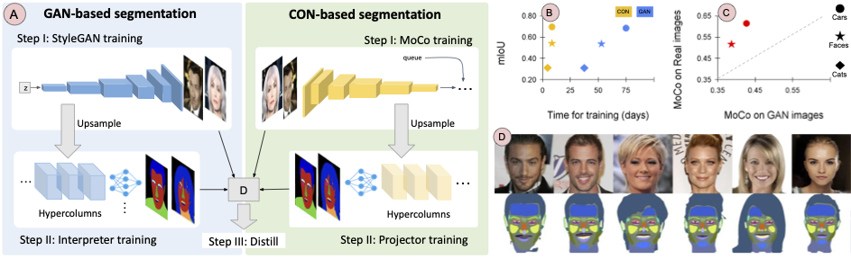

# GANorCON

This is the code for the contrastive few-shot part segmentation method proposed in

#### GANorCON : Are Generative Models Useful for Few-shot Segmentation?

[Oindrila Saha](http://oindrilasaha.github.io), [Zezhou Cheng](http://sites.google.com/site/zezhoucheng/), [Subhransu Maji](http://people.cs.umass.edu/~smaji/) 

CVPR'22

[[arXiv]](https://arxiv.org/pdf/2112.00854.pdf) [[Project page]](https://people.cs.umass.edu/~osaha/ganorcon/)



## Preparation
```
pip3 install requirements.txt
```
-> Download MoCoV2_512_CelebA.pth from [here](https://drive.google.com/file/d/1n0iyFuZ20s_DsIAorvmtVLIdHIG_65N0/) and place inside this folder

-> Place the [DatasetGAN released data](https://drive.google.com/drive/folders/1PSS0uOusN3dV84YLT9Gds1ZSugjpMz7E) at ./DatasetGAN_data inside this folder

-> Download CelebAMask from [here](https://drive.google.com/open?id=1badu11NqxGf6qM3PTTooQDJvQbejgbTv) and place inside this folder

## Training - Few Shot Segmentation

```bash

python3 train_face_seg.py --model resnet50 --segmodel fcn --layer 4 --trained_model_path MoCoV2_512_CelebA.pth --learning_rate 0.001 --weight_decay 0.0005 --adam --epochs 800 --cosine --batch_size 1 --log_path ./log.txt --model_name face_segmentor --model_path ./512_faces_celeba --image_size 512 --use_hypercol 

```
Option --segmodel can be set to either "fcn" or "UNet" for either variants described in the paper. --model_path can be set to desired location for saving the checkpoints. This command runs the training on the Face-34 dataset starting from the MoCoV2 checpoint. It displays the cross entropy loss in each epoch.

## Generate data for distillation

```bash

python3 train_face_seg.py --model resnet50 --segmodel fcn --layer 4 --trained_model_path MoCoV2_512_CelebA.pth --image_size 512 --use_hypercol --generate --gen_path ./labels_fordeeplab/ --resume ./512_faces_celeba/face_segmentor/resnet50.pth

```
Place path to the trained model resnet50.pth in --resume. Option --gen_path is where the generated predicted labels using checkpoint in --resume will be stored. This code will generate predictions on CelebA images using the model trained in the previous step to use as hard labels for distillation.

## Training - Distillation

```bash

python3 train_deeplab_contrast.py --data_path ./labels_fordeeplab/ --model_path ./512_faces_celeba_distilled --image_size 512 --num_classes 34

```
Specify the path to generated labels from previous step in --data_path and specify path to save model in --model_path. This will launch distillation using the hard labels from the few-shot trained model and will print the cross-entropy loss for iterations.

## Testing

For model from Few Shot Segmentation training:
```bash

python3 gen_score_seg.py --resume ./512_faces_celeba/Nvidia_segmentor/ --model fcn

```
--model can be also changed to UNet if UNet based segmentor was used to train.


For model from distillation:
```bash

python3 gen_score_seg.py --resume ./512_faces_celeba_distilled/deeplab_class_34_checkpoint/ --distill

```

Place the folder where all checkpoints are stored in --resume for both cases.

The above code prints the mean IoU by doing 5-fold cross validation for all saved checkpoints. Results using the above script for various configurations should be as below:

Model | fcn | UNet
--- | --- | --- 
Direct | 0.5162 | 0.5414
Distill | 0.5341 | 0.5406

#### [COMING SOON : code for Cars and Cats]

Code bulit upon https://github.com/nv-tlabs/datasetGAN_release

## Citation
If you use this code for your research, please cite the following paper.

```
@article{saha2021ganorcon,
  title={GANORCON: Are Generative Models Useful for Few-shot Segmentation?},
  author={Saha, Oindrila and Cheng, Zezhou and Maji, Subhransu},
  booktitle = {IEEE Conference on Computer Vision and Pattern Recognition (CVPR)},
  year={2022}
}
```


